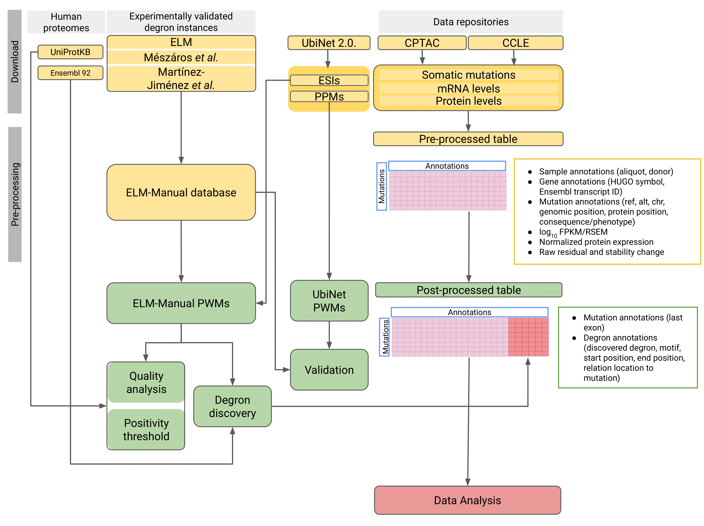

# Final Master Project

**Master in Bioinformatics and Computational Biology, Universidad Autónoma de Madrid (UAM)**\
**Barcelona Biomedical Genomics Lab (BBGLab) https://bbglab.irbbarcelona.org/** \
**Institut de Recerca Biomèdica de Barcelona (IRB Barcelona)**

Necessary code to reproduce all the data from the final master project entitled as:\
*"The impact and function of degron disruptions in c-terminal truncated proteins and its role in tumorigenesis"*
<pre>
Student:        Raquel Blanco Martínez-Illescas
Directors:      Mònica Sánchez Guixé and Núria López-Bigas
Academic tutor: Luis del Peso Ovalle
Course:         2021/2022
</pre>

The following diagram indicates the workflow to perform the analysis, including data collection and preprocessing (yellow), downstream analysis (green) and data analysis (red). All the necessary code is stored in this repository, except the scripts used to generated CPTAC and CCLE preprocessed tables. 



## Content

* [Repository structure](#repository-structure)
* [Requirements](#requirements)
* [Data collection and preprocessing](#data-collection-and-preprocessing)
* [Downstream analysis](#downstream-analysis)
* [Data analysis](#data-analysis)

## Repository structure

The repository has the following directories:
* `data`: contains any necessary data that cannot be generated with the scripts in `scripts` folder, except CPTAC and CCLE preprocessed tables. Also, contains manually edited data from external sources to adjust format to input requirements of some functions. Manually curated alignments for ELM-Manual PWMs generation are stored in `elm_manual/alignments/curated` in FASTA format and PNGs in `elm_manual/alignments/curated_pngs`. 
* `scripts`: contains all the scripts needed to reproduce the analysis. Divided in:
    * `data_collection_prepro`: scripts to run data collection and preprocessing (yellow in the workflow diagram).
    * `downstream_analysis`: scripts to run downstream analysis, including generation of Position Weight Matrices (PWMs), *de novo* degron identification and mutation annotation (green in the workflow diagram).
    * `data_analysis`: scripts to run data analysis (red in the workflow diagram).
    * `external`: scripts from external sources.
    * `Utils`: general util functions for the analysis. 

## Requirements

All the analysis was performed using conda in an environment with the dependencies in `environment.yml`. To install the same environment execute:
```
conda env create -n degrons -f environment.yml
```

## Data collection and preprocessing

### 1. UbiNet 

#### 1.1. Position Probability Matrices (PPMs)
>ubinet_PWMs.ipynb

The first part of this Jupyter notebook contains the code to parse the HTML of UbiNet 2.0 database and retrieve the PPMs of each degron motif. This notebook is stored in `scripts/downstream_analysis`.

#### 1.2. UbiNet presumed degrons
>ubinet_degrons.ipynb

Jupyter notebook with the code to collect the presumed degrons used by UbiNet to generate the PPMs motifs (used only in the last part of the UbiNet PWMs validation)

### 2. ELM-Manual database

#### 2.1. Database generation
>create_elm_manual_database.ipynb

Jupyter notebook with the code to generate the ELM-Manual database of experimentally validated degrons.

#### 2.2. Database preprocessing
>prepro_elm_manual_database.ipynb

Jupyter notebook with the code to preprocess ELM-Manual database and generate the true degron sets.

### 3. Human proteome of Ensembl 92 canonical transcripts
>ensembl_proteome.ipynb

Jupyter notebook with the code to preprocess the downloaded human proteome of Ensembl 92 canonical transcripts.

### 4. Last exons of Ensembl 92 canonical transcripts
>ensembl_last_exons.ipynb

Jupyter notebook with the code to preprocess the downloaded exons of Ensembl 92 canonical transcripts and extract every gene's last exon.

### 5. Annotate Ensembl transcript stable ID (ENST) in CCLE and CPTAC datasets
>stabch_annotate_enst.py

Python script to annotate every mutation or WT form with the ENST of the canonical transcript.

## Downstream analysis

### 1. Position Weight Matrices (PWMs) degron motifs

#### 1.1. PWMs from UbiNet degron motifs
>ubinet_PWMs.ipynb

The second part of this Jupyter notebook contains the code to transform the PPMs into PWMs.

#### 1.2. PWMs from ELM-Manual degron motifs
>elm_manual_PWMs.ipynb

Jupyter notebook with the code to align degron sequences per motif and transform curated alignments into PWMs.
Also generates intermediate PPMs. 

### 2. PWM scan

#### 2.1. Scan
>motifs_scan_proteome.py

Python script to scan a set of proteins (*e.g.*: proteome) with a PWM using a sliding window technique.

#### 2.2. True degrons scan
>motifs_separate_substrates.py

Python script to divide the `motifs_scan_proteome.py` output in true degrons and the rest of proteins.

### 3. UbiNet PWMs validation
>ubinet_PWMs_validation.ipynb

Jupyter notebook with the code to evaluate UbiNet PWMs with ELM-Manual degrons. 

### 4. PWM quality analysis (positivity threshold, information content, specificity and discovery activity)
>motifs_quality_analysis.py

Python script to calculate per motif features and quality metrics.  

### 5. PWM iterative enrichment
>motifs_iterative_enrichment_degener.py

Python script to enrich ELM-Manual PWMs using E3 ligase-substrate interactions from UbiNet database.

### 6. De novo degron identification

#### 6.1. Discovered degrons
>motifs_discovered_degrons.py

Python script to extract the discovered degrons from the `motifs_scan_proteome.py` output. 

#### 6.2. Pool overlapping degrons
>pool_overlapping_degrons.ipynb

Jupyter notebook with the code to define the overlapping discovered degrons and pool them together

### 7. Mutations in the last exon
>stabch_annotate_lastexon.py

Python script to annotate every last-exon mutation in CCLE and CPTAC datasets.

### 8. Mutation annotation in the discovered degrons
>stabch_annotate_degrons.py

Python script to annotate CPTAC and CCLE mutations and WT forms in the discovered degrons. This script
was executed in paralell for all CPTAC cancer types and CCLE using [qmap](https://github.com/bbglab/qmap)
with template file `stabch_annotate_new_instances.qmap`. 

>stabch_create_pancancer.py

Python script to merge CPTAC cancer types tables into a pancancer table after degron annotation. 

## Data analysis
>Figures.ipynb

Jupyter notebook with the code to reproduce all the plots and statistical analysis in the figures of the manuscript. 
